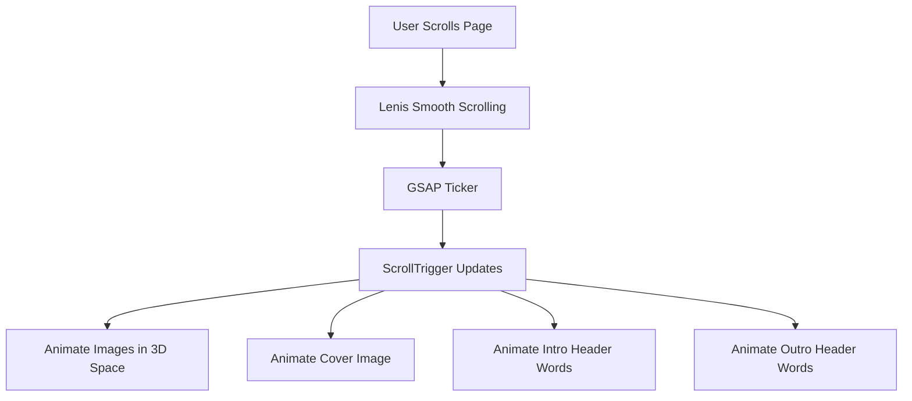
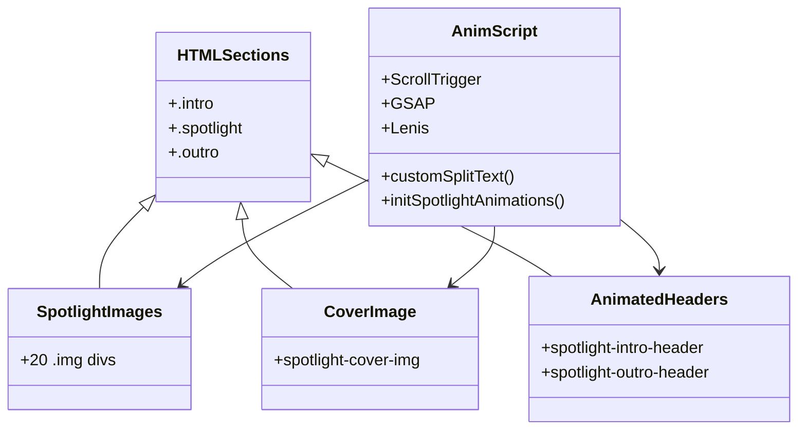

# Kaitonote Scroll Animation Documentation

This project is an interactive scroll-based animation web experience inspired by visual storytelling. The core idea is to create a dramatic, layered, and three-dimensional effect as users scroll through a sequence of images and text, with smooth transitions and engaging motion.

---

## Overview

- **HTML** structures the sections, images, and headings for the animation.
- **JavaScript** (`script.js`) controls all animation logic using GSAP, ScrollTrigger, and Lenis for smooth scrolling and 3D effects.
- **CSS** (`styles.css`) handles the overall look, layout, and responsive typography.

---

# index.html

The HTML file establishes the page structure and links all dependencies. It is the backbone that connects images, text, and scripts.

### Key Features

- **Three Main Sections:** `.intro`, `.spotlight`, and `.outro`.
- **Image Gallery:** 20 images are stacked in `.spotlight-images` for animation.
- **Cover Image:** A central `.spotlight-cover-img` overlays images during scrolling.
- **Animated Headers:** Two prominent headings within `.spotlight` animate during scroll.
- **Asset References:** Images and fonts are loaded from local directories.
- **Script Dependencies:** Imports Lenis (smooth scrolling), GSAP (animation), ScrollTrigger (scroll-based triggers), and the main `script.js`.

### HTML Structure

```html
<body>
  <section class="intro">
    <h1>Visions That Move Beyond the surface</h1>
  </section>
  <section class="spotlight">
    <div class="spotlight-images">
      <!-- 20 images, each in a .img container -->
    </div>
    <div class="spotlight-cover-img">
      
    </div>
    <div class="spotlight-intro-header">
      <h1>When Motion and Stillness Collide in Layers</h1>
    </div>
    <div class="spotlight-outro-header">
      <h1>A New Perspective Awaits in the Shadows</h1>
    </div>
  </section>
  <section class="outro">
    <h1>The future Begins Where This Moment Ends</h1>
  </section>
  <!-- Script dependencies -->
</body>
```

### Section Breakdown

| Section               | Purpose                                                       |
|-----------------------|--------------------------------------------------------------|
| `.intro`              | Introductory headline—sets the mood with large text          |
| `.spotlight`          | Main animated gallery and animated headers                   |
| `.outro`              | Exit headline—brings closure to the animation                |
| `.spotlight-images`   | Contains all animated images for the 3D scatter effect       |
| `.spotlight-cover-img`| Animated cover image that appears at a key scroll moment     |
| `.spotlight-intro-header` | Heading that fades out as user scrolls                    |
| `.spotlight-outro-header` | Heading that fades in near the end of scroll              |

---

# styles.css

The CSS file crafts a cinematic, immersive visual style. It emphasizes typography, color, and spatial layout.

### Core Principles

- **Custom Font:** Uses "Instrument Serif" for an editorial, premium feel.
- **Color Scheme:** Light background for intro/outro, dark for main spotlight.
- **Full-Viewport Layout:** Each section fills the screen (`100svh`).
- **Image Sizing:** Images are responsive, covering their containers.
- **3D Preparation:** Uses `transform-style: preserve-3d` and `perspective` for 3D animation.
- **Header Styling:** Large, bold, centered headlines.
- **Responsive Design:** Adjusts layouts for screens smaller than 1000px.

### Notable CSS Snippets

```css
html, body {
  font-family: "Instrument Serif", sans-serif;
  overflow: hidden;
}

section {
  position: relative;
  width: 100vw;
  height: 100svh;
  padding: 2rem;
  overflow: hidden;
}

.img {
  position: absolute;
  top: 50%;
  left: 50%;
  transform: translate(-50%, -50%);
  width: 500px;
  height: 350px;
  will-change: transform;
}

.spotlight-images {
  position: absolute;
  top: 0;
  left: 0;
  width: 100%;
  height: 100%;
  transform-style: preserve-3d;
  perspective: 2000px;
}
```

### Responsive Adjustments

- On smaller screens, headlines and animated headers are set to `width: 100%` for better readability.
- Padding increases for `.spotlight-intro-header` and `.spotlight-outro-header` on mobile.

---

# script.js

This file orchestrates all animations via GSAP, ScrollTrigger, and Lenis. It creates a highly interactive, scroll-driven 3D visual story.

## Initialization Steps

- **Registers GSAP plugins** (ScrollTrigger).
- **Defines `customSplitText` utility** to split header text into individual word spans for staggered animation fades (replacing GSAP's SplitText plugin for simplicity).
- **Initializes Lenis** for buttery smooth scrolling, linked with GSAP's ticker.
- **Calls `initSpotlightAnimations`** on page load & window resize to ensure responsive, dynamic setup.

## customSplitText Function

This utility splits a given text element's content into word-wrapped `<span>`s for per-word animation control.

```js
function customSplitText(element) {
  if (!element) return { words: [] };
  const text = element.textContent.trim();
  const words = text.split(/\s+/);
  element.innerHTML = "";
  const wordElements = words.map((word) => {
    const span = document.createElement("span");
    span.textContent = word;
    span.style.display = "inline-block";
    element.appendChild(span);
    element.appendChild(document.createTextNode(" "));
    return span;
  });
  return { words: wordElements };
}
```

---

## Spotlight Animation Logic

The `initSpotlightAnimations` function sets up all 3D and text fade animations. It is responsive and recalculates all positions and transformations on window resize.

### Key Steps

1. **Selects relevant DOM elements:** images, cover image, headers.
2. **Splits intro and outro headers into word spans.**
3. **Defines scatter directions:** Each image moves in a unique direction based on predefined vectors.
4. **Calculates start/end 3D positions and scales for each image.**
5. **Sets initial transforms:** All images and cover image start off-screen, small, and far away.
6. **Creates a ScrollTrigger:** Pins the `.spotlight` section and drives all animations as the user scrolls.

### Scroll-Driven Animations

- **Images:** Each image moves outward from the center in a unique 3D direction, scaling and translating in x/y/z, with a staggered effect.
- **Cover Image:** Comes forward and scales up as the scroll progresses.
- **Intro Header:** Its words fade out sequentially as you scroll deeper into the spotlight.
- **Outro Header:** Its words fade in sequentially near the end of the scroll.

### Pseudocode for Animation Loop

```js
ScrollTrigger.create({
  trigger: ".spotlight",
  start: "top top",
  end: `+=${window.innerHeight * 15}px`,
  pin: true,
  scrub: 1,
  onUpdate: (self) => {
    // Animate images outward in 3D
    // Animate cover image scaling in
    // Animate intro header words fading out
    // Animate outro header words fading in
  }
});
```

---

## Animation Architecture

Below is a diagram visualizing the main flow of data and animation logic from user scroll to animated effects.



---

## Key Animation Parameters

| Parameter                | Description                                            |
|--------------------------|--------------------------------------------------------|
| `scatterDirections`      | 20 unique (x, y) vector pairs for image movement       |
| `scatterMultiplier`      | Amount to scatter; higher on mobile for visual impact  |
| `startPositions`         | All images start at (0,0,-1000), scale 0              |
| `endPositions`           | Images move outward with unique directions, z=2000     |
| `coverImg` transforms    | Z and scale animate from (-1000, 0) to (0, 1)         |
| Text fade intervals      | Intro: fade out at 60-75% scroll; Outro: fade in at 80-95% scroll |

---

## Per-Word Header Animation

Each header fades word-by-word, creating a poetic reveal/conceal effect.

- **Intro Heading:** Words fade out sequentially between 60% and 75% of scroll progress.
- **Outro Heading:** Words fade in sequentially between 80% and 95% of scroll progress.

---

## Responsive Design

- On mobile (`window.innerWidth < 1000`), scatter distance increases for more dramatic effect.
- Headline widths adapt to device for best readability.

---

# Component Relationships

The following diagram shows how the core components of this animation experience interact:



---

# Summary Table

| File         | Main Purpose                                      | Dependencies                                     |
|--------------|---------------------------------------------------|--------------------------------------------------|
| `index.html` | Structure/layout, links assets and scripts        | GSAP, ScrollTrigger, Lenis, styles.css, script.js|
| `styles.css` | Typography, layout, 3D prep, responsive design    | Custom font, variables                           |
| `script.js`  | All animation, scroll logic, responsive behavior  | GSAP, ScrollTrigger, Lenis                       |

---

# Notable Implementation Choices

- **GSAP + ScrollTrigger:** For robust, timeline-based scroll animation.
- **Lenis:** Adds ultra-smooth scrolling, synchronized with GSAP ticker.
- **Custom SplitText:** Reduces dependency bloat for simple word-splitting.
- **3D Transforms:** Uses `perspective` and `z` for parallax and depth.
- **Responsiveness:** JavaScript recalculates all transforms on resize for consistent experience.

---

```card
{
  "title": "Best Practice: Animation Performance",
  "content": "3D transforms and will-change hint the browser for smoother, GPU-accelerated rendering."
}
```

---

```card
{
  "title": "Content Flexibility",
  "content": "Easily swap out images or text in HTML; JS logic adapts automatically for a fluid experience."
}
```

---

# No API Endpoints Present

This project is a front-end animation and does not contain any HTTP API endpoints or server-side logic. There are no API blocks required for this documentation.

---

# Final Notes

- The source is highly adaptable; swap images or headlines to create new visual narratives.
- All dependencies are loaded via CDN except for local assets (images, fonts).
- Designed for modern browsers with 3D CSS, GSAP, and ES6 support.

---

**Enjoy creating immersive scroll-based stories with Kaitonote Scroll Animation!**